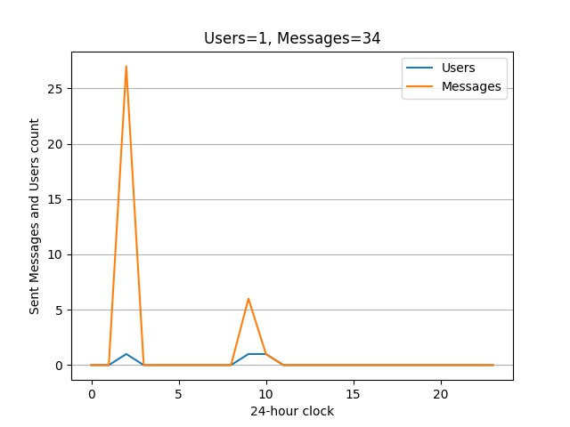

# Issue Tracker: Project SmallToolBox

Interface:
  - TelegramBot: https://t.me/smalltoolboxbot
    - Main Channel: https://t.me/smalltoolbox

  

#### TODO
- [x] Move `MessageStats.is_user_admin` into `UserChats`
  - [x] Create Table
  - [ ] Add user info
- [x] Generate User Stats
  - [x] Simple Plot
    - [x] Generate pic
    - [x] Cache Generated pic filepath
      - [x] Cache will be updated for next the `hour`
    - [ ] Clear cached data (`date < curr_date - (hours=1)`)
    - [ ] Set `stats_limit`
- [x] Generate Chat Stats
  - [x] Simple Plot
    - [x] Generate pic
    - [x] Cache Generated pic filepath
      - [x] Cache will be updated for next the `hour`
    - [ ] Clear cached data (`date < curr_date - (hours=1)`)
    - [ ] Set `stats_limit`

#### User Stats

  

#### Chat Stats

  

