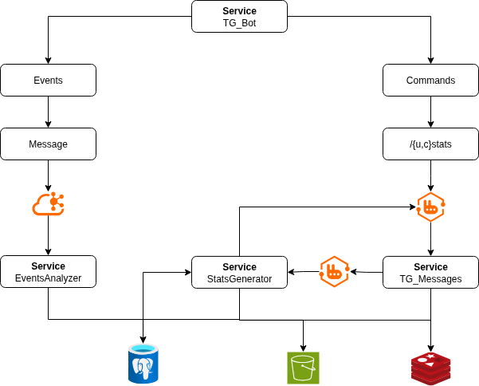

# SmallToolBox - Telegram Bot

> [!NOTE]
> Brief: [Project Diagram and Screenshots](./readme/SCREENSHOTS.md) | [TODO List](./readme/TODO.md)\
> Demo: [Telegram Group](https://t.me/smalltoolbox) | [Telegram Bot](https://t.me/smalltoolboxbot)

```
# `matplotlib.pyplot.plot` (image) Generators
/uStats - Sent Messages count in Chats
/cStats - Sent Messages and Users count
```

<details>
<summary>Dependencies</summary>
<pre>
psql -V               # psql (PostgreSQL) 15.7 (Ubuntu 15.7-0ubuntu0.23.10.1)
poetry -V             # Poetry (version 1.8.3)
poetry run python -V  # Python 3.11.6
</pre>
</details>

```
# Set an Environment variables: $TOKEN, $POSTGRESQL_URI
cp .env-EXAMPLE .env

poetry install
poetry run python main.py
```

#### Versions
- **0.1.0**
  - [x] Implemented Commands: `uStats`, `cStats`

---

<p align="center">
  
  
</p>
