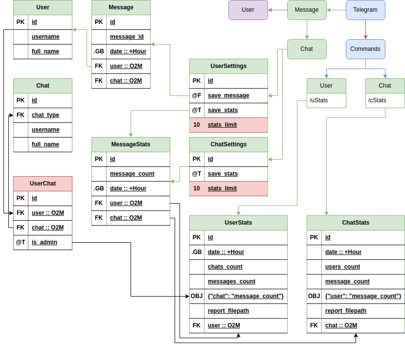

# Issue Tracker: Project Sage0x0

Interface:
  - TelegramBot: https://t.me/smalltoolboxbot
    - Main Channel: https://t.me/smalltoolbox

  
  

#### TODO
- [x] Move `MessageStats.is_user_admin` into `UserChats`
  - [x] Create Table
  - [ ] Add user info
- [ ] Generate User Stats
  - [ ] Simple Plot
    - [x] Generate pic
    - [ ] Cache Generated pic filepath
      - [ ] Cache will be updated for next the `hour`
    - [ ] Set `stats_limit`
